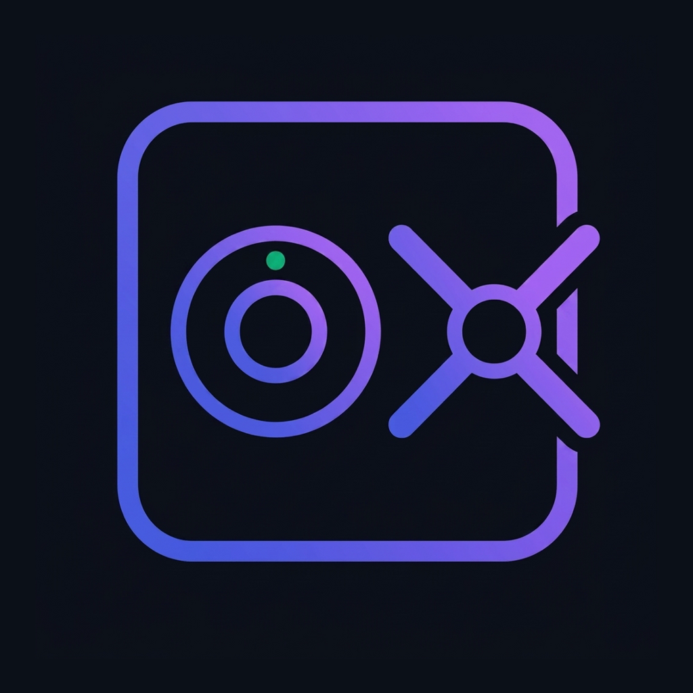

# Caveau

**Caveau** is an open-source mobile password manager and digital vault built with **Flutter**, designed around a **Zero-Knowledge** and **100% Offline** architecture. It locally encrypts and protects credentials, payment cards, secure notes, identity documents, and API tokens without ever transmitting any data over the network.

<p align="center">
  
</p>

---

## Key Features

- **Zero-Knowledge & 100% Offline**: No remote servers, no cloud accounts, and no telemetry tracking. All data resides exclusively on the local device.
- **Hardware-Backed Encryption**: Secure storage powered by `flutter_secure_storage`, leveraging **Android Keystore (AES-256)** and **iOS Keychain with Secure Enclave isolation**.
- **Hybrid Authentication**: Fast biometric access (Face ID, Touch ID, fingerprint) with fallback to a **Master PIN** (5,000 rounds of iterative SHA-256 hashing + 256-bit salt) and progressive brute-force lockout protection.
- **Privacy Shield**: Instant app blurring and obscuration when transitioning to the background or OS app switcher to prevent unintended visibility and screenshots.
- **Auto-Lock & Auto-Clearing Clipboard**: Configurable session timeout on inactivity and automatic clipboard clearing for copied sensitive data (default: 30s).
- **Multi-Language Support (5 Languages)**: Native support for **English (`en`)**, **Italian (`it`)**, **Spanish (`es`)**, **French (`fr`)**, and **German (`de`)** with runtime language switching.
- **Supported Categories**:
  - **Logins & Credentials** (username, password, URL, custom fields)
  - **Payment Cards** (with interactive visual card mockup)
  - **Secure Notes** (fullscreen encrypted notes)
  - **Identities & Documents**
  - **API Tokens & Secret Keys**
- **Password Generator & Entropy**: Cryptographically secure generator with real-time entropy estimation (bits) and strength scoring.
- **Security Audit**: Vault health monitoring dashboard with automatic detection of weak or reused passwords and overall security scoring.
- **Encrypted Backup & Restore**: Password-protected vault export and import with SHA-256 checksum integrity verification.

---

## Architecture & Tech Stack

The project follows a **Clean Architecture / MVVM** pattern with reactive state management via **Provider**:

```text
lib/
├── core/            # Cryptographic services (Auth, Storage, Clipboard), constants, localization & Dark Cyber theme
├── models/          # Data models (VaultItem, SecuritySettings, CustomField)
├── providers/       # State management (AuthProvider, VaultProvider, SettingsProvider)
└── views/           # Material 3 UI (Auth, Vault, Generator, Audit, Settings, Widgets)
```

- **Framework**: [Flutter](https://flutter.dev) (Dart SDK `^3.9.2`)
- **State Management**: `provider`
- **Security & Biometrics**: `flutter_secure_storage`, `local_auth`, `crypto`
- **Design System**: Material 3 Dark Cyber (Obsidian `#0B0F19`, Indigo `#6366F1`, Emerald `#10B981`)

---

## Prerequisites & Quick Start

### Prerequisites
- [Flutter SDK](https://docs.flutter.dev/get-started/install) (version compatible with Dart >= 3.9)
- Android Studio / Xcode for running on an emulator or physical device

### Installation

1. **Clone the repository:**
   ```bash
   git clone https://github.com/stiavelli21/Caveau.git
   cd Caveau/caveau
   ```

2. **Install dependencies:**
   ```bash
   flutter pub get
   ```

3. **Run the application:**
   ```bash
   flutter run
   ```

4. **Build Release (Android APK):**
   ```bash
   flutter build apk --release
   ```

---

## Platform & Security Notes

- **Android**: The main activity extends `FlutterFragmentActivity` for biometric authentication support, and system backup is disabled (`android:allowBackup="false"` in `AndroidManifest.xml`) to prevent unauthorized data extraction.
- **iOS**: Configured with the `NSFaceIDUsageDescription` key in `Info.plist` for authorized access to Face ID biometric sensors.

---

## License

This project is distributed for personal and open-source use. See repository details for more information.
